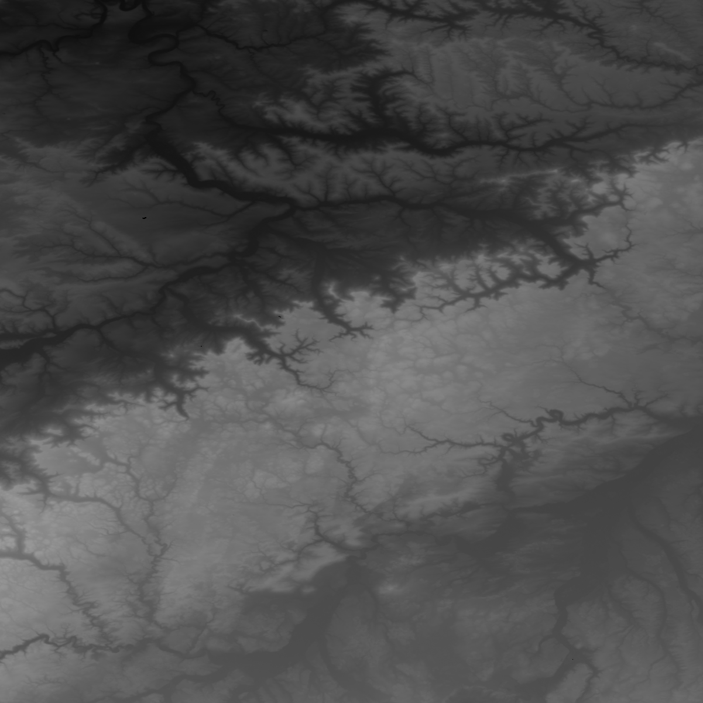

# SRTM Height Map Converter

This is a small tool to get (16-Bit PNG) images from the height map data 
generated from the satellite radar data of NASA and others.

Details about the data can be found [here](https://dds.cr.usgs.gov/srtm/version2_1/Documentation/) and the data itself (segmented by a 1° world grid) can be downloaded [here](https://dds.cr.usgs.gov/srtm/version2_1/SRTM3/).

## Example usage

To try it out, just try this:

```shell script
make # build it
./pkg/height-map/testdata/download.sh 48 10 # download some test data
./build/convert-hgt -in N48E010.hgt -out test.png -auto-improve # convert it
```

This will give you this nice picture of the Ulm region:



## License

Licensed under MIT License
